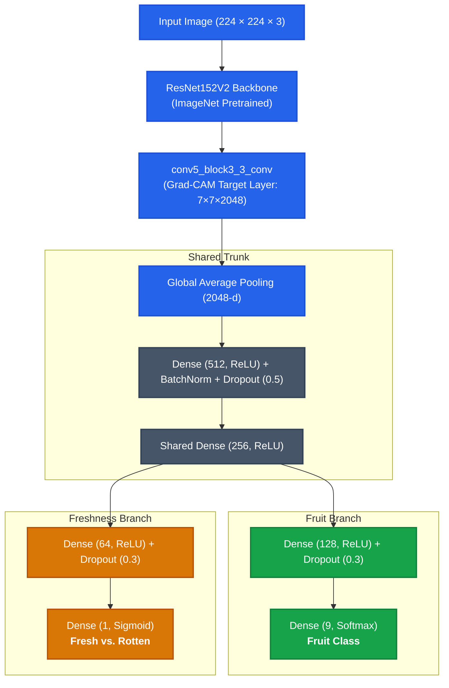

<div align="center">

# Multi-Task Fruit Classification & Freshness Detection with Grad-CAM

### IEEE ICCIT 2025 Official Research Implementation

[](https://ieeexplore.ieee.org/abstract/document/11491294)
[](https://doi.org/10.1109/ICCIT68739.2025.11491294)
[](https://ieeexplore.ieee.org/xpl/conhome/11489965/proceeding)
[](https://huggingface.co/spaces/nahinfarhan/fruit-classifier)
[](https://www.python.org/)
[](https://www.tensorflow.org/)
[](LICENSE)

<p align="center">
  <b>A unified deep learning framework that simultaneously identifies fruit variety and evaluates freshness state in a single forward pass, with visual explanations via dual-head Grad-CAM.</b>
</p>

[Read on IEEE Xplore](https://ieeexplore.ieee.org/abstract/document/11491294) • [Read Paper (PDF)](docs/IEEE_ICCIT2025_Conference_Paper.pdf) • [Live Hugging Face Demo](https://huggingface.co/spaces/nahinfarhan/fruit-classifier) • [Benchmark](#benchmark-results) • [Grad-CAM](#explainability-with-grad-cam) • [Citation](#citation)

</div>

---

## Overview

* **Problem:** In agricultural packaging and food sorting, identifying the fruit type and inspecting its freshness are usually handled by two separate models. Running two models sequentially doubles inference time and computational cost.
* **Our Approach:** We designed a **Multi-Task ResNet152V2** network with a shared convolutional trunk and two specialized output heads: one for 9-class fruit categorization and one for binary freshness assessment (fresh vs. rotten).
* **Key Results:**
  * **99.64%** fruit classification accuracy across 9 categories.
  * **97.27%** freshness detection accuracy (**0.998 ROC-AUC**).
  * **98.45%** combined multi-task test accuracy.
  * Evaluated against 8 other architectures (including Vision Transformers, ConvNeXt, DenseNet, InceptionV3, and YOLOv3), achieving the lowest error and highest overall accuracy.
* **Explainability:** We integrated **dual-head Grad-CAM** to verify that the model learns genuine physical cues: the fruit head focuses on shape, calyx, and stem geometry, while the freshness head isolates skin discoloration and rot lesions.

---

## Performance Summary

| Metric | Proposed (ResNet152V2) | DenseNet121 (Second Best) | Difference |
| :--- | :---: | :---: | :---: |
| **Fruit Classification Accuracy** | **99.64%** | 99.44% | +0.20% |
| **Freshness Detection Accuracy** | **97.27%** | 95.66% | +1.61% |
| **Combined Accuracy** | **98.45%** | 97.55% | +0.90% |
| **Freshness ROC-AUC** | **0.998** | 0.985 | +0.013 |
| **Test Loss** | **0.028** | 0.040 | -0.012 |
| **Pipeline** | **Single Model** | Two Separate Models | 1 forward pass |

<div align="center">
  
  <p><i>Figure 1: Accuracy and loss trajectories across all 9 benchmarked architectures.</i></p>
</div>

---

## Explainability with Grad-CAM

Deep learning models used in food inspection cannot be black boxes. We applied **Gradient-weighted Class Activation Mapping (Grad-CAM)** at the final convolutional block (`conv5_block3_3_conv`) to inspect what each head focuses on:

<div align="center">
  
  <p><i>Figure 2: Dual-head Grad-CAM heatmaps showing how each branch specializes on different visual features.</i></p>
</div>

### Observations:
1. **Branch Specialization:** Even though both branches share the same feature extractor, the gradient signals diverge clearly:
   * **Fruit Head:** Attends to structural features like overall shape, aspect ratio, and stem position.
   * **Freshness Head:** Attends directly to surface defects, dark spots, fungal growth, and bruised skin.
2. **Localization:** On fresh samples, freshness activations remain evenly distributed over intact skin. On rotten samples, the activations tightly localize around the boundaries of visible decay.

<div align="center">
  
  
</div>

---

## Live Demo & Web App

You can test the trained model directly in your browser without any setup:

👉 **[Live Hugging Face Spaces Demo](https://huggingface.co/spaces/nahinfarhan/fruit-classifier)**

<div align="center">
  
  
  <p><i>Figure 3: Web interface running real-time inference with dual predictions and Grad-CAM visualizations.</i></p>
</div>

To run the app locally:
```bash
streamlit run app.py
```

---

## Model Architecture

The model uses a **ResNet152V2** backbone pre-trained on ImageNet, with the last 30 layers fine-tuned. Feature representations pass through a shared dense layer before splitting into two independent prediction heads:



### Loss Function:
$$\mathcal{L}_{\text{total}} = \alpha \cdot \mathcal{L}_{\text{fruit}} + \beta \cdot \mathcal{L}_{\text{freshness}}$$

where $\alpha = 0.7$ (Categorical Cross-Entropy) and $\beta = 0.3$ (Binary Cross-Entropy).

---

## Benchmark Results

All 9 models were evaluated under identical data splits (70% train, 20% validation, 10% test) on the 30,357-image dataset:

| Model | Fruit Acc (%) | Freshness Acc (%) | Combined Acc (%) | Test Loss |
| :--- | :---: | :---: | :---: | :---: |
| **ResNet152V2 (Proposed)** | **99.64** | **97.27** | **98.45** | **0.0282** |
| DenseNet121 | 99.44 | 95.66 | 97.55 | 0.0400 |
| InceptionV3 | 99.08 | 95.52 | 97.30 | 0.0495 |
| ConvNeXt-Base | 96.91 | 91.84 | 94.37 | 0.1415 |
| Vision Transformer (ViT-Base) | 84.14 | 78.81 | 81.47 | 0.4447 |
| VGG16 | 92.96 | 56.76 | 74.86 | 0.3308 |
| Custom CNN Baseline | 71.54 | 68.08 | 69.81 | 0.6280 |
| YOLOv3 Backbone + FC | 58.51 | 59.86 | 59.18 | 0.9275 |
| EfficientNet-B4 | 45.61 | 56.01 | 50.81 | 1.1351 |

<div align="center">
  
  
  <p><i>Figure 4: Confusion matrices on the test set for Fruit Variety (left) and Freshness (right).</i></p>
</div>

---

## Repository Structure

```text
├── assets/                       # Figures for documentation and results
├── diagrams/                     # Source Draw.io architectural diagrams
├── docs/                         # Conference paper, presentation slides, and credentials
│   ├── IEEE_ICCIT2025_Conference_Paper.pdf
│   ├── ICCIT2025_Conference_Certificate.pdf
│   ├── Conference_Presentation_Slides.pptx
│   └── Conference_Presentation_Slides.pdf
├── models/                       # Model configuration & weight download guide
│   └── README.md
├── notebooks/                    # Jupyter notebooks for training and evaluation
│   ├── fruit_freshness_multitask_xai.ipynb
│   └── archive/
├── results/                      # Evaluation metrics and baseline plots
├── src/                          # Modular Python source code
│   ├── __init__.py               # Label mappings and constants
│   ├── model.py                  # Model architecture and compilation
│   ├── gradcam.py                # Dual-head Grad-CAM implementation
│   └── predict.py                # CLI inference script
├── app.py                        # Streamlit web application
├── CITATION.cff                  # Citation metadata
├── LICENSE                       # MIT License
├── requirements.txt              # Python dependencies
└── README.md                     # Documentation
```

---

## Getting Started

### 1. Environment Setup
```bash
git clone https://github.com/RifatHossaiN47/conference-fruit-freshness-xai.git
cd conference-fruit-freshness-xai

# Create virtual environment
python -m venv venv
source venv/bin/activate  # On Windows: venv\Scripts\activate

# Install dependencies
pip install -r requirements.txt
```

### 2. Run the Web Application
```bash
streamlit run app.py
```

### 3. Command-Line Inference
```bash
python src/predict.py --image path/to/sample.jpg --gradcam
```

### 4. Training Notebook
The complete training, evaluation, and plotting workflow is available in `notebooks/fruit_freshness_multitask_xai.ipynb`.

---

## Citation

If you find this work or codebase useful, please cite our paper:

```bibtex
@INPROCEEDINGS{11491294,
  author={Hossen, Md Rifat and Abdullah, Md Nahian and Farhan, MD Nahin and Chakma, Nino and Pantho, Denesh Barua},
  booktitle={2025 28th International Conference on Computer and Information Technology (ICCIT)}, 
  title={A Multi Task Deep Learning Model for Fruit Detection and Freshness Classification with GradCAM Explainability}, 
  year={2025},
  pages={347-352},
  doi={10.1109/ICCIT68739.2025.11491294},
  publisher={IEEE}
}
```

Paper on IEEE Xplore: [https://ieeexplore.ieee.org/abstract/document/11491294](https://ieeexplore.ieee.org/abstract/document/11491294)

---

## Authors

* **Md Rifat Hossen** ([IEEE](https://ieeexplore.ieee.org/author/37089928121) • `rifat8851@gmail.com`) — *Dept. of Computer Science and Engineering, CUET*
* **Md Nahian Abdullah** ([IEEE](https://ieeexplore.ieee.org/author/628425155997373) • `mdnahianabdullah95@gmail.com`) — *Dept. of Electrical and Electronic Engineering, CUET*
* **MD Nahin Farhan** ([IEEE](https://ieeexplore.ieee.org/author/190924578641229) • `nahinfarhan.czs@gmail.com`) — *Dept. of Computer Science and Engineering, CUET*
* **Nino Chakma** ([IEEE](https://ieeexplore.ieee.org/author/334014166865499) • `www.nino39@gmail.com`) — *Dept. of Computer Science and Engineering, CUET*
* **Denesh Barua Pantho** ([IEEE](https://ieeexplore.ieee.org/author/776320405692555) • `pantho625@gmail.com`) — *Dept. of Computer Science and Engineering, CUET*

**Institution:** Chittagong University of Engineering and Technology (CUET), Chittagong, Bangladesh.  
*Presented at the 2025 28th International Conference on Computer and Information Technology (ICCIT), Cox's Bazar, Bangladesh.*

---

## License

This project is licensed under the MIT License — see the [LICENSE](LICENSE) file for details.
