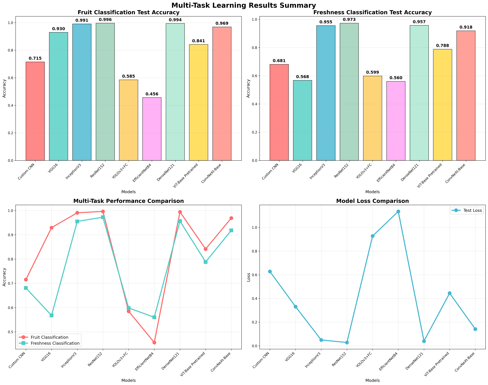
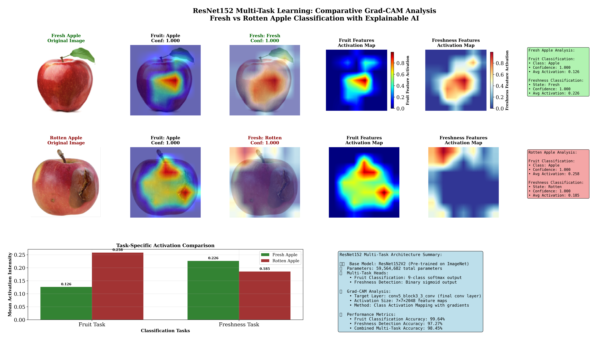
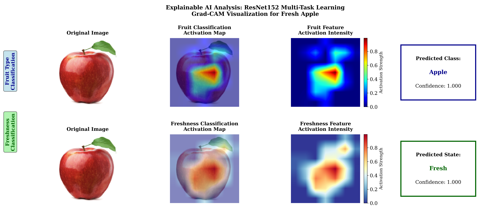
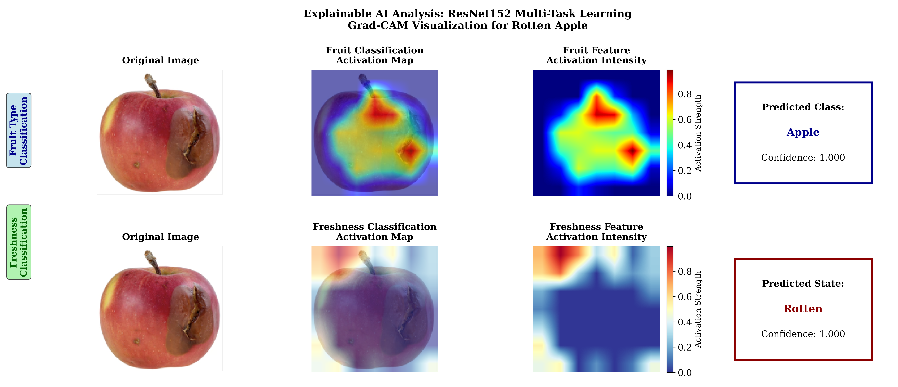
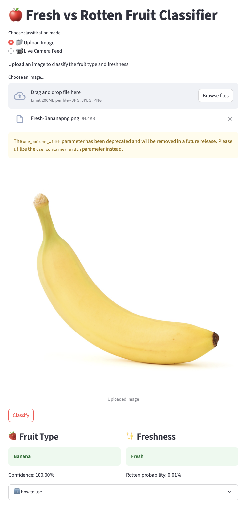
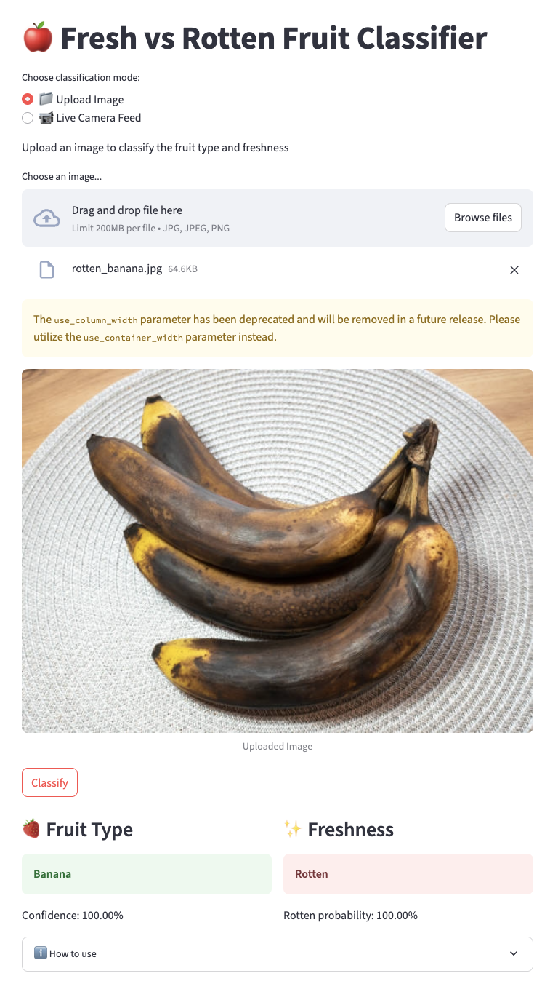
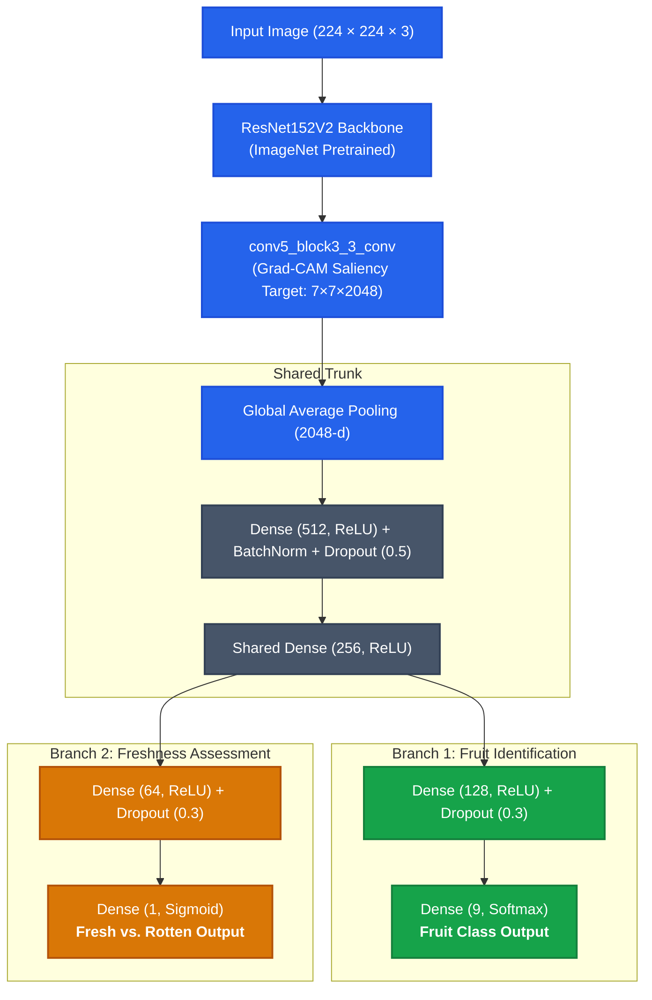
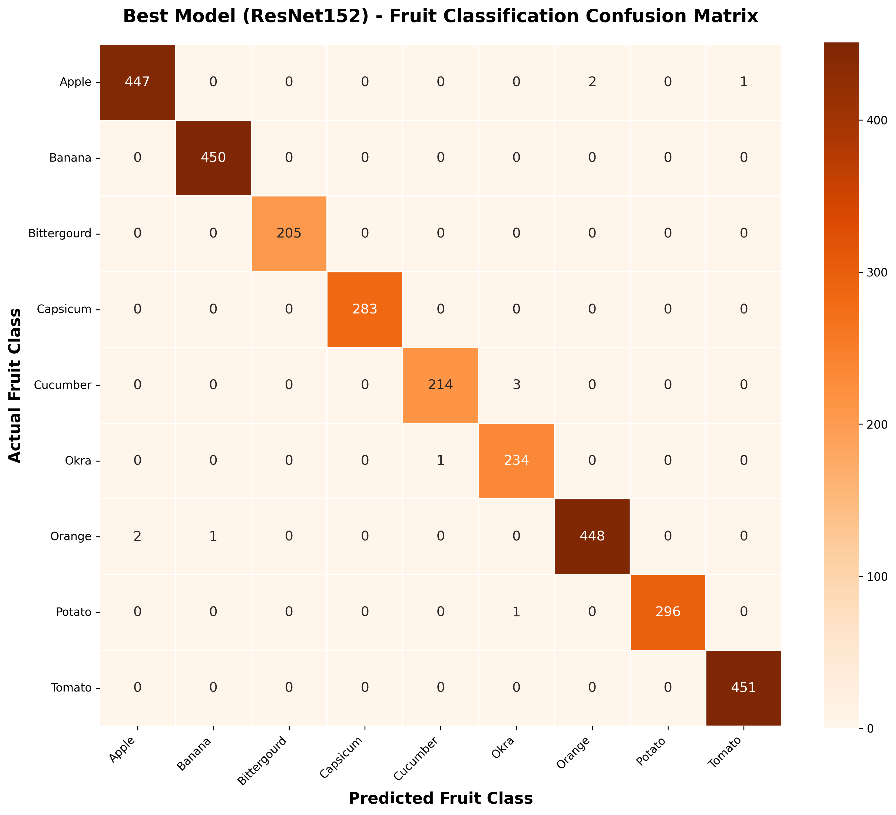
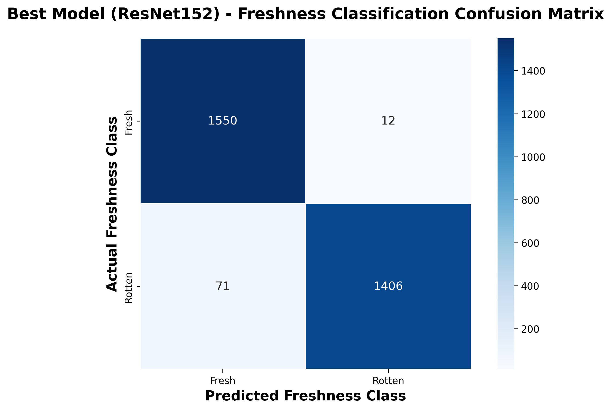

<div align="center">

# 🍎 Multi-Task Fruit & Freshness Classification with Grad-CAM Explainability

### IEEE ICCIT 2025 Official Research Implementation

[](https://ieeexplore.ieee.org/abstract/document/11491294)
[](https://doi.org/10.1109/ICCIT68739.2025.11491294)
[](https://ieeexplore.ieee.org/xpl/conhome/11489965/proceeding)
[](https://www.python.org/)
[](https://www.tensorflow.org/)
[](app.py)
[](LICENSE)

<p align="center">
  <b>A unified, explainable deep learning framework that simultaneously identifies fruit variety and evaluates freshness state in a single forward pass.</b>
</p>

[**Read Paper on IEEE Xplore**](https://ieeexplore.ieee.org/abstract/document/11491294) • [**Interactive Demo**](#-interactive-web-application) • [**Benchmark Results**](#-comprehensive-benchmark-evaluation) • [**Explainable AI (Grad-CAM)**](#-explainable-ai-with-grad-cam) • [**Citation**](#-citation)

</div>

---

## ⚡ 30-Second Summary for Recruiters & Researchers

* **The Problem:** Conventional automated sorting in agriculture requires running separate computer vision models for product identification and quality inspection, incurring double computational overhead and high latency.
* **Our Solution:** A **Multi-Task ResNet152V2** architecture featuring a shared feature representation trunk and dual task-specific classification heads (9-class fruit type + binary freshness assessment).
* **The Breakthrough:**
  * **99.64%** Fruit Classification Accuracy across 9 varieties
  * **97.27%** Freshness Detection Accuracy (**0.998 ROC-AUC**)
  * **98.45%** Combined Multi-Task Test Accuracy
  * **Outperforms 8 state-of-the-art architectures**, including Vision Transformers (ViT), ConvNeXt, DenseNet, InceptionV3, and YOLOv3.
* **Explainability (XAI):** Integrated **dual-head Grad-CAM** proving the network evaluates morphological structure (shape, stem) for fruit identity while isolating surface blemishes and necrotic lesions for freshness.

---

## 🚀 Key Highlights & Performance Snapshot

| Metric | Proposed ResNet152V2 | Nearest Competitor (DenseNet121) | Relative Advantage |
| :--- | :---: | :---: | :---: |
| **Fruit Classification Accuracy** | **99.64%** | 99.44% | **+0.20%** |
| **Freshness Detection Accuracy** | **97.27%** | 95.66% | **+1.61%** |
| **Combined Multi-Task Accuracy** | **98.45%** | 97.55% | **+0.90%** |
| **Freshness ROC-AUC** | **0.998** | 0.985 | **Top Calibration** |
| **Test Loss** | **0.028** | 0.040 | **-30% Lower Error** |
| **Inference Efficiency** | **Single Model** | Separate Pipelines | **2× Latency Reduction** |

<div align="center">
  
  <p><i>Figure 1: Benchmark evaluation across 9 deep learning architectures showing accuracy and loss trajectories.</i></p>
</div>

---

## 🔍 Explainable AI with Grad-CAM

Deep learning models deployed in food safety and supply chain automation require trust and interpretability. We employ **Gradient-weighted Class Activation Mapping (Grad-CAM)** at the final convolutional block (`conv5_block3_3_conv`) to inspect the spatial attention of both classification branches:

<div align="center">
  
  <p><i>Figure 2: Dual-head Grad-CAM activations: the fruit branch attends to global morphology while the freshness branch pinpoints rot lesions.</i></p>
</div>

### Scientific Takeaways:
1. **Task-Disentangled Representations:** Although both branches share the same convolutional backbone, the gradients reveal clear specialization:
   * **Fruit Identification Head:** Focuses on overall silhouette, aspect ratio, calyx, and stem geometry.
   * **Freshness Assessment Head:** Concentrates on localized discoloration, surface bruises, fungal spots, and necrotic tissues.
2. **Confidence-Grounded Saliency:** On healthy fruit samples, freshness activations remain smoothly distributed across intact skin; on defective samples, attention concentrates sharply on rot boundaries.

<div align="center">
  
  
</div>

---

## 🌐 Interactive Web Application

We engineered a real-time web application using **Streamlit** (also deployed on **Hugging Face Spaces**) that supports both batch image uploads and live webcam capture.

<div align="center">
  
  
  <p><i>Figure 3: Interactive real-time deployment demonstrating fruit classification and freshness prediction with instant explainability.</i></p>
</div>

Run the web app locally in seconds:
```bash
streamlit run app.py
```

---

## 🏗️ Multi-Task Architecture

The proposed network leverages **ResNet152V2** pre-trained on ImageNet, unfreezing the terminal 30 layers for task-specific transfer learning. Extracted feature maps pass through a shared trunk before bifurcating into two independent decision heads:



### Multi-Task Objective Function:
$$\mathcal{L}_{\text{total}} = \alpha \cdot \mathcal{L}_{\text{fruit}} + \beta \cdot \mathcal{L}_{\text{freshness}}$$

Where $\alpha = 0.7$ (Categorical Cross-Entropy for 9 fruit classes) and $\beta = 0.3$ (Binary Cross-Entropy for Fresh vs. Rotten state).

---

## 📊 Comprehensive Benchmark Evaluation

All 9 candidate models were trained and benchmarked under identical data splits (70% train, 20% validation, 10% test) on the **30,357-image Kaggle dataset**:

| Rank | Model Architecture | Test Fruit Acc | Test Fresh Acc | Combined Test Acc | Test Loss |
| :---: | :--- | :---: | :---: | :---: | :---: |
| 🥇 | **ResNet152V2 (Proposed)** | **99.64%** | **97.27%** | **98.45%** | **0.0282** |
| 🥈 | DenseNet121 | 99.44% | 95.66% | 97.55% | 0.0400 |
| 🥉 | InceptionV3 | 99.08% | 95.52% | 97.30% | 0.0495 |
| 4 | ConvNeXt-Base | 96.91% | 91.84% | 94.37% | 0.1415 |
| 5 | Vision Transformer (ViT-Base) | 84.14% | 78.81% | 81.47% | 0.4447 |
| 6 | VGG16 | 92.96% | 56.76% | 74.86% | 0.3308 |
| 7 | Custom CNN (Baseline) | 71.54% | 68.08% | 69.81% | 0.6280 |
| 8 | YOLOv3 Backbone + FC | 58.51% | 59.86% | 59.18% | 0.9275 |
| 9 | EfficientNet-B4 | 45.61% | 56.01% | 50.81% | 1.1351 |

<div align="center">
  
  
  <p><i>Figure 4: Confusion matrices on unseen test set for Fruit Variety (left) and Freshness State (right).</i></p>
</div>

---

## 📁 Repository Structure

```text
├── assets/                       # High-resolution figures for README & documentation
│   ├── gradcam_comparative_analysis.png
│   ├── model_comparison_summary.png
│   ├── confusion_matrix_fruit.png
│   ├── confusion_matrix_freshness.png
│   ├── roc_curve_freshness.png
│   ├── resnet152_classification_report.png
│   ├── methodology_pipeline.png
│   ├── web_demo_fresh.png
│   └── web_demo_rotten.png
├── diagrams/                     # Source Draw.io architectural diagrams
│   ├── resnet152v2_multitask_architecture.drawio
│   ├── methodology_flowchart.drawio
│   └── paper_figure_layouts.drawio
├── docs/                         # Conference presentation and credentials
│   ├── ICCIT2025_Conference_Certificate.pdf
│   ├── Conference_Presentation_Slides.pptx
│   └── Conference_Presentation_Slides.pdf
├── models/                       # Model storage and release instructions
│   └── README.md                 # Download guide for ResNet152.keras (348.7 MB)
├── notebooks/                    # Interactive research notebooks
│   ├── fruit_freshness_multitask_xai.ipynb   # Complete conference training & evaluation code
│   └── archive/                  # Earlier iterations & PDF exports
├── results/                      # Raw metrics and baseline evaluation plots
│   ├── multi_task_model_comparison_results.csv
│   ├── gradcam_analysis_summary.txt
│   └── baseline_plots/           # Individual training curves for all 9 models
├── src/                          # Modular Python source code
│   ├── __init__.py               # Package metadata & label constants
│   ├── model.py                  # Model architecture definition & compilation
│   ├── gradcam.py                # Dual-head Grad-CAM implementation
│   └── predict.py                # Standalone CLI inference script
├── app.py                        # Interactive Streamlit web application
├── CITATION.cff                  # Native GitHub citation metadata
├── LICENSE                       # MIT Open-Source License
├── requirements.txt              # Pinned environment dependencies
└── README.md                     # Project overview and documentation
```

---

## 🛠️ Quickstart & Reproducibility

### 1. Clone & Set Up Environment
```bash
git clone https://github.com/RifatHossaiN47/conference-fruit-freshness-xai.git
cd conference-fruit-freshness-xai

# Create virtual environment
python -m venv venv
source venv/bin/activate  # On Windows: venv\Scripts\activate

# Install dependencies
pip install -r requirements.txt
```

### 2. Run the Streamlit Web Application
```bash
streamlit run app.py
```

### 3. Run Inference from the Command Line
```bash
# Predict fruit type & freshness with Grad-CAM heatmaps
python src/predict.py --image path/to/sample.jpg --gradcam
```

### 4. Explore Research Notebook
Open `notebooks/fruit_freshness_multitask_xai.ipynb` in Jupyter Notebook, VS Code, Google Colab, or Kaggle to reproduce training, validation, and figure generation.

---

## 📖 Citation

If this research or codebase assists your work, please cite our IEEE ICCIT 2025 paper:

```bibtex
@INPROCEEDINGS{11491294,
  author={Hossen, Md Rifat and Abdullah, Md Nahian and Farhan, MD Nahin and Chakma, Nino and Pantho, Denesh Barua},
  booktitle={2025 28th International Conference on Computer and Information Technology (ICCIT)}, 
  title={A Multi Task Deep Learning Model for Fruit Detection and Freshness Classification with GradCAM Explainability}, 
  year={2025},
  volume={},
  number={},
  pages={347-352},
  keywords={Central Processing Unit;Feedback;Circuits;Location awareness;Protocols;Mobile communication;HTTP;Convolutional neural networks;Deep learning;Learning (artificial intelligence);Food Quality Assessment;Multi-task CNN;Transfer learning;Grad-CAM;Real-time deployment},
  doi={10.1109/ICCIT68739.2025.11491294},
  publisher={IEEE}
}
```

### IEEE Xplore Link:
👉 **[https://ieeexplore.ieee.org/abstract/document/11491294](https://ieeexplore.ieee.org/abstract/document/11491294)**

---

## 👥 Authors & Acknowledgments

* **Md Rifat Hossen** ([IEEE Profile](https://ieeexplore.ieee.org/author/37089928121))
* **Md Nahian Abdullah** ([IEEE Profile](https://ieeexplore.ieee.org/author/628425155997373))
* **MD Nahin Farhan** ([IEEE Profile](https://ieeexplore.ieee.org/author/190924578641229))
* **Nino Chakma** ([IEEE Profile](https://ieeexplore.ieee.org/author/334014166865499))
* **Denesh Barua Pantho** ([IEEE Profile](https://ieeexplore.ieee.org/author/776320405692555))

*Presented at the **2025 28th International Conference on Computer and Information Technology (ICCIT)**, Cox's Bazar, Bangladesh.*

---

<div align="center">
  <sub>Built with ❤️ for reproducible AI research in food quality assessment and smart agriculture.</sub>
</div>
